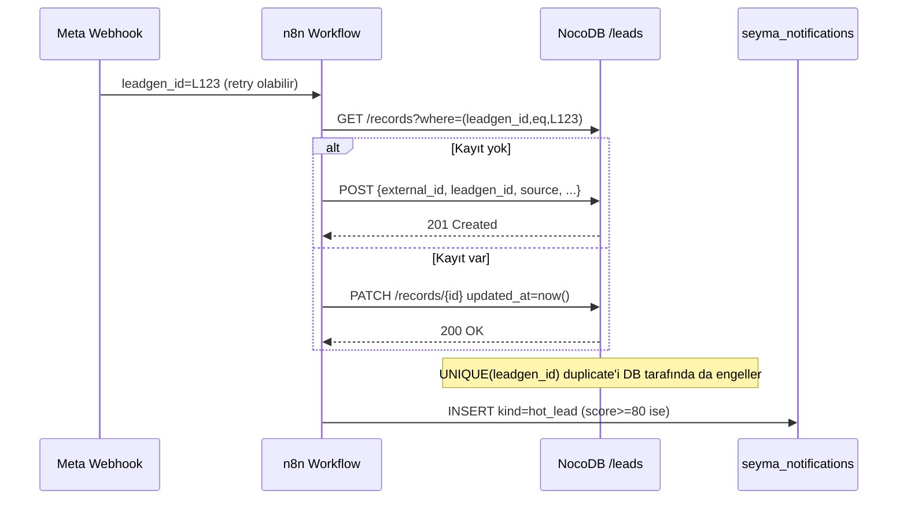
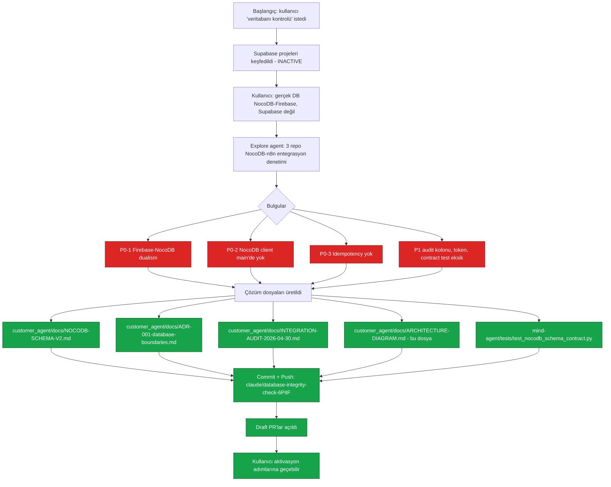
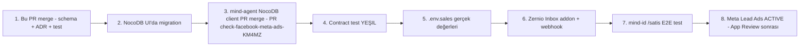

# Mimari Diyagram — Veritabanı Sınırları ve Veri Akışı

**Tarih:** 2026-04-30
**Bağlam:** ADR-001 ve NOCODB-SCHEMA-V2 ile birlikte okuyun.

---

## 1. Yüksek Seviye — Veritabanı Sınırları

```mermaid
flowchart LR
    subgraph EXT[Dış Kaynaklar]
        META[Meta Lead Ads]
        IG[Instagram DM]
        WA[WhatsApp]
        WEB[Web Form / Webhook]
    end

    subgraph N8N[n8n Cloud — Orchestrator]
        W1[Meta Lead Ads Agent]
        W2[Lead Toplama Agent]
        W3[Takip Agent]
        W4[Itiraz Agent]
        W5[Upsell Agent]
    end

    subgraph NOCO[(NocoDB — CRM SoT)]
        T1[leads]
        T2[lead_messages]
        T3[seyma_notifications]
    end

    subgraph MA[mind-agent — Python Backend]
        NC[nocodb_client]
        FC[firebase_client]
        AG[agents]
    end

    subgraph FB[(Firestore — Media/Ops)]
        F1[businesses/media]
        F2[instagram_stats]
        F3[errors / threads]
    end

    subgraph MID[mind-id — Next.js Portal]
        SAT["/satis tab"]
    end

    META --> W1
    IG --> W2
    WA --> W3
    WEB --> W2

    W1 -- upsert external_id --> T1
    W2 -- upsert external_id --> T1
    W3 -- insert --> T2
    W4 -- insert --> T2
    W5 -- update stage --> T1
    W1 & W2 & W3 & W4 & W5 -- insert --> T3

    AG --> NC
    NC <-- read+write --> NOCO
    AG --> FC
    FC <-- read+write --> FB

    SAT -- read-only --> NC

    classDef sot fill:#1f6feb,stroke:#0b3d91,color:#fff
    classDef ops fill:#6b21a8,stroke:#3b0764,color:#fff
    classDef block fill:#0f766e,stroke:#064e3b,color:#fff
    class NOCO sot
    class FB ops
    class N8N,MA,MID block
```

**Altın kural:** Mavi blok (NocoDB) **CRM source of truth**. Mor blok (Firestore) **medya / operasyonel state**. Bir entity sadece bir blokta yaşar.

---

## 2. Idempotent Yazma Akışı (Lead Upsert)



---

## 3. Bu Oturumda Yapılanlar — Akış Şeması



---

## 4. Repo Sorumluluk Matrisi

| Repo | Rol | Yazdığı DB | Okuduğu DB |
|---|---|---|---|
| **customer_agent** | Mimari + dokümantasyon | — | — |
| **mind-agent** | Agent backend (Python) | NocoDB (CRM via `nocodb_client`) · Firestore (medya/ops via `firebase_client`) | İkisi de |
| **mind-id** | Next.js portal (`/satis`) | — (read-only) | NocoDB (read token) |
| **n8n** | Workflow orchestrator | NocoDB (CRM) | NocoDB (lookup için) |

---

## 5. Aktivasyon Sırası (DEVİR notu ile uyumlu)



Her adım bir öncekine bağımlıdır — atlamayın. Adım 4 **kırmızı kalırsa** sonraki adımlara geçmeyin: kırık şema = sessiz veri kaybı.
